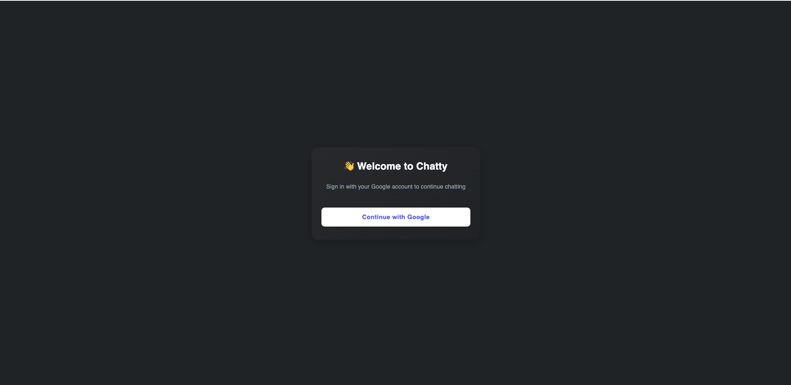
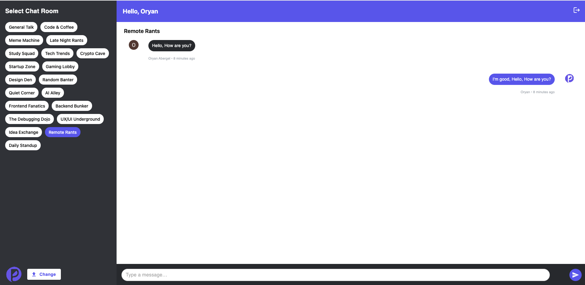

# 💬 Chatty

**Chatty** is a simple, real-time group chat application built using **React**, **TypeScript**, **Vite**, and **Firebase**. It features multiple chat rooms, Google authentication, and responsive design with live message updates.

🔗 **Live Site**:  
https://firebase-chat-d7vuffs8z-oryans-projects-f49e6feb.vercel.app/

---

## 📸 Screenshots

> _Add screenshots here once available_  
> 📍 Placeholders below:

- Home/Login  
  

- Chat Room  
  

---

## 🛠️ Tech Stack

| Tech                       | Purpose                                     |
| -------------------------- | ------------------------------------------- |
| **React** + **TypeScript** | UI & type-safe component structure          |
| **Vite**                   | Fast frontend bundler                       |
| **Firebase**               | Backend services (Auth, Firestore, Storage) |
| **Material UI**            | UI components & styling                     |
| **Day.js**                 | Time formatting for messages                |

---

## ✅ Features

- 🔐 **Google Sign-in** via Firebase Authentication
- 💬 **Multi-room chat support**
- 🔄 **Real-time message updates** via Firestore
- 🧑‍💻 **User avatars and names** displayed with each message
- ☁️ **Profile photo upload** (replaces Google avatar)
- 🌓 Clean and responsive UI (MUI + custom styles)
